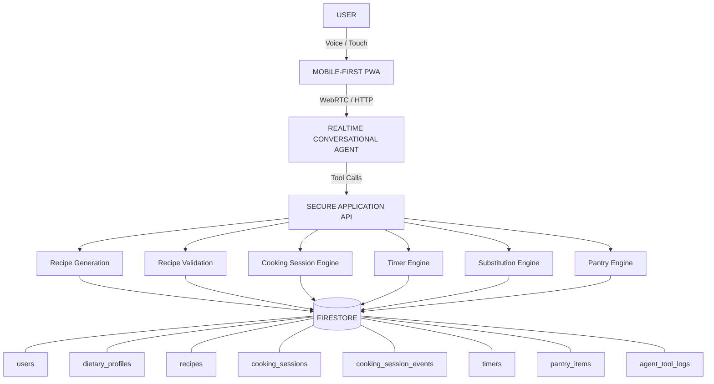

# Architecture — Kitchen Agent (Cook with Freebuff)

The Kitchen Agent is a voice-first, screen-light cooking companion. This
document describes the layered architecture; the Mermaid diagram below is the
conceptual shape from the K9 spec.

## Mermaid — conceptual architecture



## Layers

1. **Client** (`app/`, `components/`) — Next.js App Router. The `/cook`
   screen renders the ONE current action; a VoiceIndicator shows
   LISTENING / THINKING / SPEAKING / OFFLINE / ERROR. Client components never
   import server modules (`import 'server-only'` guards enforce this).

2. **API layer** (`app/api/*/route.ts`) — Next route handlers. Every route
   resolves the Firebase ID token via `resolveUserId` (server-side) and builds
   a `ToolContext` for that uid. The client never supplies the user id.

3. **Conversational agent** (`lib/agent/`) — `ConversationOrchestrator`
   routes each utterance deterministically: command table → ingredient
   extraction → free-form provider (Gemini function calling). Tool calls are
   executed through the registry and never answer from conversational memory.

4. **Secure tool layer** (`lib/server/tools/`) — the ONLY way the model
   touches state. `executeTool` validates args against zod schemas, runs the
   backend logic, sanitizes args, and writes an `agent_tool_log` with latency
   and error code. Failures are returned as structured envelopes — never
   thrown to the model.

5. **Services** (`lib/server/`) — `SessionService` (state machine + events),
   `GuidedCookingService` (one-action delivery, safety gate, timers,
   substitution, recovery), `PantryService` (confidence + staleness +
   recipe consumption), `DietaryProfileService`.

6. **Repositories** (`lib/server/repositories.ts`) — typed Firestore CRUD,
   schema-validated on every write. The single place raw Firestore calls exist
   (besides `verify-live.mjs`, the e2e driver).

7. **Data** — Firestore in a SHARED project with the portfolio app, under the
   union ruleset. Every collection is owner-scoped (`userId == auth.uid` or
   keyed `users/<uid>`).

## Request flow (one conversational turn)

```
utterance → /api/agent → orchestrator → command? → tool → backend → Firestore
                                    ↘ provider (Gemini) → tool calls → backend
response ←───────────────────────────────────────────────────────────────────
```

A `correlationId` threads the whole turn (see OBSERVABILITY in
[SECURITY.md](./SECURITY.md) and the structured logger in
`lib/server/logger.ts`).

See also: [DATA_MODEL.md](./DATA_MODEL.md), [AGENT_TOOLS.md](./AGENT_TOOLS.md),
[STATE_MACHINE.md](./STATE_MACHINE.md), [VOICE_ARCHITECTURE.md](./VOICE_ARCHITECTURE.md).
